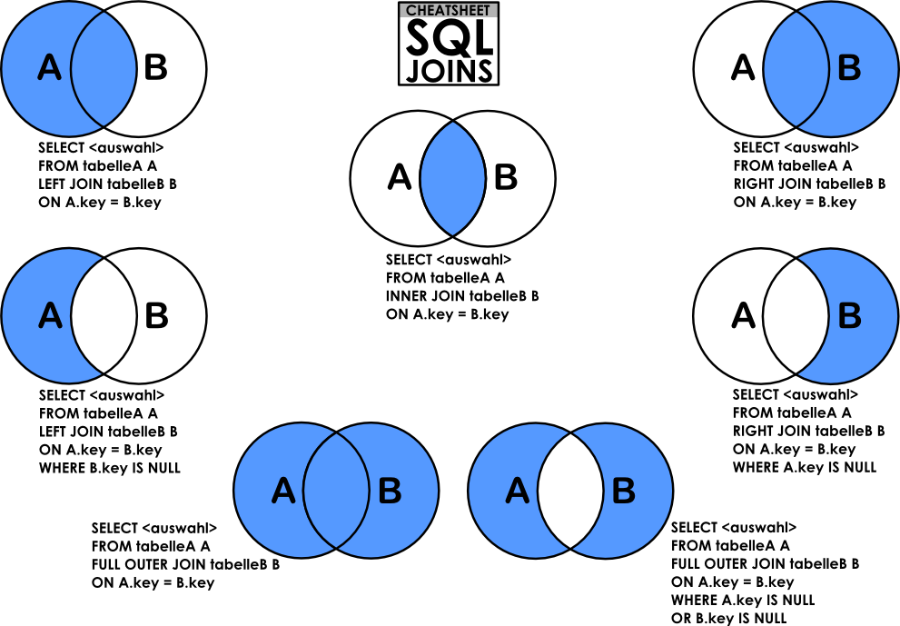

# 0x0E. SQL - More queries 

<h2>Resources</h2>

<strong>Read or watch</strong>:

<ul>
<li><a href="https://www.digitalocean.com/community/tutorials/how-to-create-a-new-user-and-grant-permissions-in-mysql" title="How To Create a New User and Grant Permissions in MySQL" target="_blank">How To Create a New User and Grant Permissions in MySQL</a> </li>
<li><a href="https://www.mysqltutorial.org/mysql-grant.aspx" title="How To Use MySQL GRANT Statement To Grant Privileges To a User" target="_blank">How To Use MySQL GRANT Statement To Grant Privileges To a User</a> </li>
<li><a href="https://zetcode.com/mysql/constraints/" title="MySQL constraints" target="_blank">MySQL constraints</a> </li>
<li><a href="https://web.csulb.edu/colleges/coe/cecs/dbdesign/dbdesign.php?page=sql/subqueries.php" title="SQL technique: subqueries" target="_blank">SQL technique: subqueries</a> </li>
<li><a href="https://web.csulb.edu/colleges/coe/cecs/dbdesign/dbdesign.php?page=sql/join.php" title="Basic query operation: the join" target="_blank">Basic query operation: the join</a> </li>
<li><a href="https://web.csulb.edu/colleges/coe/cecs/dbdesign/dbdesign.php?page=sql/multijoin.php" title="SQL technique: multiple joins and the distinct keyword" target="_blank">SQL technique: multiple joins and the distinct keyword</a> </li>
<li><a href="https://web.csulb.edu/colleges/coe/cecs/dbdesign/dbdesign.php?page=sql/jointypes.php" title="SQL technique: join types" target="_blank">SQL technique: join types</a> </li>
<li><a href="https://web.csulb.edu/colleges/coe/cecs/dbdesign/dbdesign.php?page=sql/setops.php" title="SQL technique: union and minus" target="_blank">SQL technique: union and minus</a> </li>
<li><a href="https://intellipaat.com/mediaFiles/2019/02/SQL-Commands-Cheat-Sheet.pdf" title="MySQL Cheat Sheet" target="_blank">MySQL Cheat Sheet</a> </li>
<li><a href="https://tableplus.com/blog/2018/09/a-beginners-guide-to-seven-types-of-sql-joins.html" title="The Seven Types of SQL Joins" target="_blank">The Seven Types of SQL Joins</a> </li>
<li><a href="https://www.youtube.com/watch?v=yPu6qV5byu4" title="MySQL Tutorial" target="_blank">MySQL Tutorial</a> </li>
<li><a href="https://www.sqlstyle.guide/" title="SQL Style Guide" target="_blank">SQL Style Guide</a> </li>
<li><a href="https://dev.mysql.com/doc/refman/8.0/en/sql-statements.html" title="MySQL 8.0 SQL Statement Syntax" target="_blank">MySQL 8.0 SQL Statement Syntax</a> </li>
</ul>

Extra resources around relational database model design:

<ul>
<li><a href="https://www.guru99.com/database-design.html" title="Design" target="_blank">Design</a></li>
<li><a href="https://www.guru99.com/database-normalization.html" title="Normalization" target="_blank">Normalization</a></li>
<li><a href="https://www.guru99.com/er-modeling.html" title="ER Modeling" target="_blank">ER Modeling</a></li>
</ul>

<h2>Learning Objectives</h2>

<ul>
<li>How to create a new MySQL user</li>
<li>How to manage privileges for a user to a database or table</li>
<li>What&rsquo;s a <code>PRIMARY KEY</code></li>
<li>What&rsquo;s a <code>FOREIGN KEY</code></li>
<li>How to use <code>NOT NULL</code> and <code>UNIQUE</code> constraints</li>
<li>How to retrieve datas from multiple tables in one request</li>
<li>What are subqueries</li>
<li>What are <code>JOIN</code> and <code>UNION</code></li>
</ul>

<h2>More Info</h2>

<h3>Install MySQL 8.0 on Ubuntu 20.04 LTS</h3>

<pre><code>$ sudo apt update
$ sudo apt install mysql-server
...
$ mysql --version
mysql  Ver 8.0.25-0ubuntu0.20.04.1 for Linux on x86_64 ((Ubuntu))
$
</code></pre>

Connect to your MySQL server:

<pre><code>$ sudo mysql
Welcome to the MySQL monitor.  Commands end with ; or \g.
Your MySQL connection id is 11
Server version: 8.0.25-0ubuntu0.20.04.1 (Ubuntu)

Copyright (c) 2000, 2021, Oracle and/or its affiliates.

Oracle is a registered trademark of Oracle Corporation and/or its
affiliates. Other names may be trademarks of their respective
owners.

Type &#39;help;&#39; or &#39;\h&#39; for help. Type &#39;\c&#39; to clear the current input statement.

mysql&gt;
mysql&gt; quit
Bye
$
</code></pre>

<h3>Use &ldquo;container-on-demand&rdquo; to run MySQL</h3>

<strong>In the container, credentials are <code>root/root</code></strong>

<ul>
<li>Ask for container <code>Ubuntu 20.04</code></li>
<li>Connect via SSH</li>
<li>OR connect via the Web terminal</li>
<li>In the container, you should start MySQL before playing with it:</li>
</ul>

<pre><code>$ service mysql start                                                   
 * Starting MySQL database server mysqld 
$
$ cat 0-list_databases.sql | mysql -uroot -p                               
Database                                                                                   
information_schema                                                                         
mysql                                                                                      
performance_schema                                                                         
sys                      
$
</code></pre>

<strong>In the container, credentials are <code>root/root</code></strong>

<h3>How to import a SQL dump</h3>

<pre><code>$ echo &quot;CREATE DATABASE hbtn_0d_tvshows;&quot; | mysql -uroot -p

Enter password: 

$ curl &quot;./tvshows.sql&quot; -s | mysql -uroot -p hbtn_0d_tvshows
Enter password: 
$ echo &quot;SELECT * FROM tv_genres&quot; | mysql -uroot -p hbtn_0d_tvshows
Enter password: 
id  name
1   Drama
2   Mystery
3   Adventure
4   Fantasy
5   Comedy
6   Crime
7   Suspense
8   Thriller
$
</code></pre>

  

---

[<h3>Quiz questions</h3>](quiz.md)

---

# TASKS

### 0. My privileges!
    

Write a script that lists all privileges of the MySQL users <code>user_0d_1</code> and <code>user_0d_2</code> on your server (in <code>localhost</code>).

<pre><code>guillaume@ubuntu:~/$ cat 0-privileges.sql | mysql -hlocalhost -uroot -p
Enter password: 
ERROR 1141 (42000) at line 3: There is no such grant defined for user &#39;user_0d_1&#39; on host &#39;localhost&#39;
guillaume@ubuntu:~/$ 
guillaume@ubuntu:~/$ echo &quot;CREATE USER &#39;user_0d_1&#39;@&#39;localhost&#39;;&quot; |  mysql -hlocalhost -uroot -p
Enter password: 
guillaume@ubuntu:~/$ echo &quot;GRANT ALL PRIVILEGES ON *.* TO &#39;user_0d_1&#39;@&#39;localhost&#39;;&quot; |  mysql -hlocalhost -uroot -p
Enter password: 
guillaume@ubuntu:~/$ cat 0-privileges.sql | mysql -hlocalhost -uroot -p
Enter password: 
Grants for user_0d_1@localhost                                                                                                
GRANT SELECT, INSERT, UPDA..., DROP ROLE ON *.* TO `user_0d_1`@`localhost`                                                                                                                             
GRANT APPLICATION_PASSWORD_ADMIN,AUDIT...,XA_RECOVER_ADMIN ON *.* TO `user_0d_1`@`localhost`                                        
ERROR 1141 (42000) at line 4: There is no such grant defined for user &#39;user_0d_2&#39; on host &#39;localhost&#39;              
guillaume@ubuntu:~/$ 
</code></pre>

  

[Answer](./0-privileges.sql)

---

### 1. Root user
   

Write a script that creates the MySQL server user <code>user_0d_1</code>. 

<ul>
<li><code>user_0d_1</code> should have all privileges on your MySQL server</li>
<li>The <code>user_0d_1</code> password should be set to <code>user_0d_1_pwd</code></li>
<li>If the user <code>user_0d_1</code> already exists, your script should not fail</li>
</ul>

<pre><code>guillaume@ubuntu:~/$ cat 1-create_user.sql | mysql -hlocalhost -uroot -p
Enter password: 
guillaume@ubuntu:~/$ cat 0-privileges.sql | mysql -hlocalhost -uroot -p
Enter password: 
Grants for user_0d_1@localhost                                                                                                
GRANT SELECT, INSERT..., DROP ROLE ON *.* TO `user_0d_1`@`localhost`                                                                                                                             
GRANT APPLICATION_PASSWORD_ADMIN,...,XA_RECOVER_ADMIN ON *.* TO `user_0d_1`@`localhost`                                        
ERROR 1141 (42000) at line 4: There is no such grant defined for user &#39;user_0d_2&#39; on host &#39;localhost&#39;
guillaume@ubuntu:~/$ 
</code></pre>

  

[Answer](./1-create_user.sql)

---

### 2. Read user
    

Write a script that creates the database <code>hbtn_0d_2</code> and the user <code>user_0d_2</code>. 

<ul>
<li><code>user_0d_2</code> should have only SELECT privilege in the database <code>hbtn_0d_2</code></li>
<li>The <code>user_0d_2</code> password should be set to <code>user_0d_2_pwd</code></li>
<li>If the database <code>hbtn_0d_2</code> already exists, your script should not fail</li>
<li>If the user <code>user_0d_2</code> already exists, your script should not fail</li>
</ul>

<pre><code>guillaume@ubuntu:~/$ cat 2-create_read_user.sql | mysql -hlocalhost -uroot -p
Enter password: 
guillaume@ubuntu:~/$ cat 0-privileges.sql | mysql -hlocalhost -uroot -p
Enter password: 
Grants for user_0d_1@localhost                                                                                                
GRANT SELECT, ..., DROP ROLE ON *.* TO `user_0d_1`@`localhost`                                                                                                                             
GRANT APPLICATION_PASSWORD_ADMIN,...,XA_RECOVER_ADMIN ON *.* TO `user_0d_1`@`localhost`                                        
Grants for user_0d_2@localhost                                                                                                
GRANT USAGE ON *.* TO `user_0d_2`@`localhost`                                                                                 
GRANT SELECT ON `hbtn_0d_2`.* TO `user_0d_2`@`localhost`  
guillaume@ubuntu:~/$ 
</code></pre>

  

[Answer](./2-create_read_user.sql)

---

### 3. Always a name
   

Write a script that creates the table <code>force_name</code> on your MySQL server.

<ul>
<li><code>force_name</code> description:

<ul>
<li><code>id</code> INT</li>
<li><code>name</code> VARCHAR(256) can&rsquo;t be null</li>
</ul></li>
<li>The database name will be passed as an argument of the <code>mysql</code> command</li>
<li>If the table <code>force_name</code> already exists, your script should not fail</li>
</ul>

<pre><code>guillaume@ubuntu:~/$ cat 3-force_name.sql | mysql -hlocalhost -uroot -p hbtn_0d_2
Enter password: 
guillaume@ubuntu:~/$ echo &#39;INSERT INTO force_name (id, name) VALUES (89, &quot;Best School&quot;);&#39; | mysql -hlocalhost -uroot -p hbtn_0d_2
Enter password: 
guillaume@ubuntu:~/$ echo &#39;SELECT * FROM force_name;&#39; | mysql -hlocalhost -uroot -p hbtn_0d_2
Enter password: 
id  name
89  Best School
guillaume@ubuntu:~/$ echo &#39;INSERT INTO force_name (id) VALUES (333);&#39; | mysql -hlocalhost -uroot -p hbtn_0d_2
Enter password: 
ERROR 1364 (HY000) at line 1: Field &#39;name&#39; doesn&#39;t have a default value
guillaume@ubuntu:~/$ echo &#39;SELECT * FROM force_name;&#39; | mysql -hlocalhost -uroot -p hbtn_0d_2
Enter password: 
id  name
89  Best School
guillaume@ubuntu:~/$ 
</code></pre>

  

[Answer](./3-force_name.sql)

---

### 4. ID can&#39;t be null
    

Write a script that creates the table <code>id_not_null</code> on your MySQL server.

<ul>
<li><code>id_not_null</code> description:

<ul>
<li><code>id</code> INT with the default value <code>1</code> </li>
<li><code>name</code> VARCHAR(256)</li>
</ul></li>
<li>The database name will be passed as an argument of the <code>mysql</code> command</li>
<li>If the table <code>id_not_null</code> already exists, your script should not fail</li>
</ul>

<pre><code>guillaume@ubuntu:~/$ cat 4-never_empty.sql | mysql -hlocalhost -uroot -p hbtn_0d_2
Enter password: 
guillaume@ubuntu:~/$ echo &#39;INSERT INTO id_not_null (id, name) VALUES (89, &quot;Best School&quot;);&#39; | mysql -hlocalhost -uroot -p hbtn_0d_2
Enter password: 
guillaume@ubuntu:~/$ echo &#39;SELECT * FROM id_not_null;&#39; | mysql -hlocalhost -uroot -p hbtn_0d_2
Enter password: 
id  name
89  Best School
guillaume@ubuntu:~/$ echo &#39;INSERT INTO id_not_null (name) VALUES (&quot;Best&quot;);&#39; | mysql -hlocalhost -uroot -p hbtn_0d_2
Enter password: 
guillaume@ubuntu:~/$ echo &#39;SELECT * FROM id_not_null;&#39; | mysql -hlocalhost -uroot -p hbtn_0d_2
Enter password: 
id  name
89  Best School
1   Best
guillaume@ubuntu:~/$ 
</code></pre>

  

[Answer](./4-never_empty.sql)

---

### 5. Unique ID
    

Write a script that creates the table <code>unique_id</code> on your MySQL server.

<ul>
<li><code>unique_id</code> description:

<ul>
<li><code>id</code> INT with the default value <code>1</code> and must be unique</li>
<li><code>name</code> VARCHAR(256)</li>
</ul></li>
<li>The database name will be passed as an argument of the <code>mysql</code> command</li>
<li>If the table <code>unique_id</code> already exists, your script should not fail</li>
</ul>

<pre><code>guillaume@ubuntu:~/$ cat 5-unique_id.sql | mysql -hlocalhost -uroot -p hbtn_0d_2
Enter password: 
guillaume@ubuntu:~/$ echo &#39;INSERT INTO unique_id (id, name) VALUES (89, &quot;Best School&quot;);&#39; | mysql -hlocalhost -uroot -p hbtn_0d_2
Enter password: 
guillaume@ubuntu:~/$ echo &#39;SELECT * FROM unique_id;&#39; | mysql -hlocalhost -uroot -p hbtn_0d_2
Enter password: 
id  name
89  Best School
guillaume@ubuntu:~/$ echo &#39;INSERT INTO unique_id (id, name) VALUES (89, &quot;Best&quot;);&#39; | mysql -hlocalhost -uroot -p hbtn_0d_2
Enter password: 
ERROR 1062 (23000) at line 1: Duplicate entry &#39;89&#39; for key &#39;unique_id.id&#39;
guillaume@ubuntu:~/$ echo &#39;SELECT * FROM unique_id;&#39; | mysql -hlocalhost -uroot -p hbtn_0d_2
Enter password: 
id  name
89  Best School
guillaume@ubuntu:~/$ 
</code></pre>

  

[Answer](./5-unique_id.sql)

---

### 6. States table
    

Write a script that creates the database <code>hbtn_0d_usa</code> and the table <code>states</code> (in the database <code>hbtn_0d_usa</code>) on your MySQL server.

<ul>
<li><code>states</code> description:

<ul>
<li><code>id</code> INT unique, auto generated, can&rsquo;t be null and is a primary key</li>
<li><code>name</code> VARCHAR(256) can&rsquo;t be null</li>
</ul></li>
<li>If the database <code>hbtn_0d_usa</code> already exists, your script should not fail</li>
<li>If the table <code>states</code> already exists, your script should not fail</li>
</ul>

<pre><code>guillaume@ubuntu:~/$ cat 6-states.sql | mysql -hlocalhost -uroot -p
Enter password: 
guillaume@ubuntu:~/$ echo &#39;INSERT INTO states (name) VALUES (&quot;California&quot;), (&quot;Arizona&quot;), (&quot;Texas&quot;);&#39; | mysql -hlocalhost -uroot -p hbtn_0d_usa
Enter password: 
guillaume@ubuntu:~/$ echo &#39;SELECT * FROM states;&#39; | mysql -hlocalhost -uroot -p hbtn_0d_usa
Enter password: 
id  name
1   California
2   Arizona
3   Texas
guillaume@ubuntu:~/$ 
</code></pre>

  

[Answer](./6-states.sql)

---

### 7. Cities table
 

Write a script that creates the database <code>hbtn_0d_usa</code> and the table <code>cities</code> (in the database <code>hbtn_0d_usa</code>) on your MySQL server.

<ul>
<li><code>cities</code> description:

<ul>
<li><code>id</code> INT unique, auto generated, can&rsquo;t be null and is a primary key</li>
<li><code>state_id</code> INT, can&rsquo;t be null and must be a <code>FOREIGN KEY</code> that references to <code>id</code> of the <code>states</code> table</li>
<li><code>name</code> VARCHAR(256) can&rsquo;t be null</li>
</ul></li>
<li>If the database <code>hbtn_0d_usa</code> already exists, your script should not fail</li>
<li>If the table <code>cities</code> already exists, your script should not fail</li>
</ul>

<pre><code>guillaume@ubuntu:~/$ cat 7-cities.sql | mysql -hlocalhost -uroot -p
Enter password: 
guillaume@ubuntu:~/$ echo &#39;INSERT INTO cities (state_id, name) VALUES (1, &quot;San Francisco&quot;);&#39; | mysql -hlocalhost -uroot -p hbtn_0d_usa
Enter password: 
guillaume@ubuntu:~/$ echo &#39;SELECT * FROM cities;&#39; | mysql -hlocalhost -uroot -p hbtn_0d_usa
Enter password: 
id  state_id    name
1   1   San Francisco
guillaume@ubuntu:~/$ echo &#39;INSERT INTO cities (state_id, name) VALUES (10, &quot;Paris&quot;);&#39; | mysql -hlocalhost -uroot -p hbtn_0d_usa
Enter password: 
ERROR 1452 (23000) at line 1: Cannot add or update a child row: a foreign key constraint fails (`hbtn_0d_usa`.`cities`, CONSTRAINT `cities_ibfk_1` FOREIGN KEY (`state_id`) REFERENCES `states` (`id`))
guillaume@ubuntu:~/$ echo &#39;SELECT * FROM cities;&#39; | mysql -hlocalhost -uroot -p hbtn_0d_usa
Enter password: 
id  state_id    name
1   1   San Francisco
guillaume@ubuntu:~/$ 
</code></pre>

  

[Answer](./7-cities.sql)

---

### 8. Cities of California
    

Write a script that lists all the cities of California that can be found in the database <code>hbtn_0d_usa</code>.

<ul>
<li>The <code>states</code> table contains only one record where <code>name</code> = <code>California</code> (but the <code>id</code> can be different, as per the example)</li>
<li>Results must be sorted in ascending order by <code>cities.id</code> </li>
<li>You are not allowed to use the <code>JOIN</code> keyword</li>
<li>The database name will be passed as an argument of the <code>mysql</code> command</li>
</ul>

<pre><code>guillaume@ubuntu:~/$ echo &#39;SELECT * FROM states;&#39; | mysql -hlocalhost -uroot -p hbtn_0d_usa
Enter password: 
id  name
1   California
2   Arizona
3   Texas
4   Utah
guillaume@ubuntu:~/$ echo &#39;SELECT * FROM cities;&#39; | mysql -hlocalhost -uroot -p hbtn_0d_usa
Enter password: 
id  state_id    name
1   1   San Francisco
2   1   San Jose
4   2   Page
6   3   Paris
7   3   Houston
8   3   Dallas
guillaume@ubuntu:~/$ cat 8-cities_of_california_subquery.sql | mysql -hlocalhost -uroot -p hbtn_0d_usa
Enter password: 
id  name
1   San Francisco
2   San Jose
guillaume@ubuntu:~/$ 
</code></pre>

[Answer](./8-cities_of_california_subquery.sql)

---

### 9. Cities by States
    

Write a script that lists all cities contained in the database <code>hbtn_0d_usa</code>.

<ul>
<li>Each record should display: <code>cities.id</code> - <code>cities.name</code> - <code>states.name</code></li>
<li>Results must be sorted in ascending order by <code>cities.id</code> </li>
<li>You can use only one <code>SELECT</code> statement</li>
<li>The database name will be passed as an argument of the <code>mysql</code> command</li>
</ul>

<pre><code>guillaume@ubuntu:~/$ echo &#39;SELECT * FROM states;&#39; | mysql -hlocalhost -uroot -p hbtn_0d_usa
Enter password: 
id  name
1   California
2   Arizona
3   Texas
4   Utah
guillaume@ubuntu:~/$ echo &#39;SELECT * FROM cities;&#39; | mysql -hlocalhost -uroot -p hbtn_0d_usa
Enter password: 
id  state_id    name
1   1   San Francisco
2   1   San Jose
4   2   Page
6   3   Paris
7   3   Houston
8   3   Dallas
guillaume@ubuntu:~/$ cat 9-cities_by_state_join.sql | mysql -hlocalhost -uroot -p hbtn_0d_usa
Enter password: 
id  name    name
1   San Francisco   California
2   San Jose    California
4   Page    Arizona
6   Paris   Texas
7   Houston Texas
8   Dallas  Texas
guillaume@ubuntu:~/$ 
</code></pre>

  

[Answer](./9-cities_by_state_join.sql)

---

### 10. Genre ID by show
   

Import the database dump from <code>hbtn_0d_tvshows</code> to your MySQL server: <a href="./tvshows.sql" title="download" target="_blank">download</a>

Write a script that lists all shows contained in <code>hbtn_0d_tvshows</code> that have at least one genre linked.

<ul>
<li>Each record should display: <code>tv_shows.title</code> - <code>tv_show_genres.genre_id</code></li>
<li>Results must be sorted in ascending order  by <code>tv_shows.title</code> and <code>tv_show_genres.genre_id</code></li>
<li>You can use only one <code>SELECT</code> statement</li>
<li>The database name will be passed as an argument of the <code>mysql</code> command</li>
</ul>

<pre><code>guillaume@ubuntu:~/$ cat 10-genre_id_by_show.sql | mysql -hlocalhost -uroot -p hbtn_0d_tvshows
Enter password: 
title   genre_id
Breaking Bad    1
Breaking Bad    6
Breaking Bad    7
Breaking Bad    8
Dexter  1
Dexter  2
Dexter  6
Dexter  7
Dexter  8
Game of Thrones 1
Game of Thrones 3
Game of Thrones 4
House   1
House   2
New Girl    5
Silicon Valley  5
The Big Bang Theory 5
The Last Man on Earth   1
The Last Man on Earth   5
guillaume@ubuntu:~/$ 
</code></pre>

  

[Answer](./10-genre_id_by_show.sql)

---

### 11. Genre ID for all shows
    

Import the database dump of <code>hbtn_0d_tvshows</code> to your MySQL server: <a href="./tvshows.sql" title="download" target="_blank">download</a> (same as <code>10-genre_id_by_show.sql</code>)

Write a script that lists all shows contained in the database <code>hbtn_0d_tvshows</code>.

<ul>
<li>Each record should display: <code>tv_shows.title</code> - <code>tv_show_genres.genre_id</code></li>
<li>Results must be sorted in ascending order by <code>tv_shows.title</code> and <code>tv_show_genres.genre_id</code></li>
<li>If a show doesn&rsquo;t have a genre, display <code>NULL</code></li>
<li>You can use only one <code>SELECT</code> statement</li>
<li>The database name will be passed as an argument of the <code>mysql</code> command</li>
</ul>

<pre><code>guillaume@ubuntu:~/$ cat 11-genre_id_all_shows.sql | mysql -hlocalhost -uroot -p hbtn_0d_tvshows
Enter password: 
title   genre_id
Better Call Saul    NULL
Breaking Bad    1
Breaking Bad    6
Breaking Bad    7
Breaking Bad    8
Dexter  1
Dexter  2
Dexter  6
Dexter  7
Dexter  8
Game of Thrones 1
Game of Thrones 3
Game of Thrones 4
Homeland    NULL
House   1
House   2
New Girl    5
Silicon Valley  5
The Big Bang Theory 5
The Last Man on Earth   1
The Last Man on Earth   5
guillaume@ubuntu:~/$ 
</code></pre>

  

[Answer](./11-genre_id_all_shows.sql)

---

### 12. No genre
    

Import the database dump from <code>hbtn_0d_tvshows</code> to your MySQL server: <a href="./tvshows.sql" title="download" target="_blank">download</a> (same as <code>11-genre_id_all_shows.sql</code>)

Write a script that lists all shows contained in <code>hbtn_0d_tvshows</code> without a genre linked. 

<ul>
<li>Each record should display: <code>tv_shows.title</code> - <code>tv_show_genres.genre_id</code></li>
<li>Results must be sorted in ascending order by <code>tv_shows.title</code> and <code>tv_show_genres.genre_id</code></li>
<li>You can use only one <code>SELECT</code> statement</li>
<li>The database name will be passed as an argument of the <code>mysql</code> command</li>
</ul>

<pre><code>guillaume@ubuntu:~/$ cat 12-no_genre.sql | mysql -hlocalhost -uroot -p hbtn_0d_tvshows
Enter password: 
title   genre_id
Better Call Saul    NULL
Homeland    NULL
guillaume@ubuntu:~/$ 
</code></pre>

  

[Answer](./12-no_genre.sql)

---

### 13. Number of shows by genre
    

Import the database dump from <code>hbtn_0d_tvshows</code> to your MySQL server: <a href="./tvshows.sql" title="download" target="_blank">download</a> (same as <code>12-no_genre.sql</code>)

Write a script that lists all genres from <code>hbtn_0d_tvshows</code> and displays the number of shows linked to each.

<ul>
<li>Each record should display: <code>&lt;TV Show genre&gt;</code> - <code>&lt;Number of shows linked to this genre&gt;</code></li>
<li>First column must be called <code>genre</code></li>
<li>Second column must be called <code>number_of_shows</code></li>
<li>Don&rsquo;t display a genre that doesn&rsquo;t have any shows linked</li>
<li>Results must be sorted in descending order by the number of shows linked</li>
<li>You can use only one <code>SELECT</code> statement</li>
<li>The database name will be passed as an argument of the <code>mysql</code> command</li>
</ul>

<pre><code>guillaume@ubuntu:~/$ cat 13-count_shows_by_genre.sql | mysql -hlocalhost -uroot -p hbtn_0d_tvshows
Enter password: 
genre   number_of_shows
Drama   5
Comedy  4
Mystery 2
Crime   2
Suspense    2
Thriller    2
Adventure   1
Fantasy 1
guillaume@ubuntu:~/$ 
</code></pre>

  

[Answer](./13-count_shows_by_genre.sql)

---

### 14. My genres
    

Import the database dump from <code>hbtn_0d_tvshows</code> to your MySQL server: <a href="./tvshows.sql" title="download" target="_blank">download</a> (same as <code>13-count_shows_by_genre.sql</code>)

Write a script that uses the <code>hbtn_0d_tvshows</code> database to lists all genres of the show <code>Dexter</code>.

<ul>
<li>The <code>tv_shows</code> table contains only one record where <code>title</code> = <code>Dexter</code> (but the <code>id</code> can be different)</li>
<li>Each record should display: <code>tv_genres.name</code></li>
<li>Results must be sorted in ascending order by the genre name</li>
<li>You can use only one <code>SELECT</code> statement</li>
<li>The database name will be passed as an argument of the <code>mysql</code> command</li>
</ul>

<pre><code>guillaume@ubuntu:~/$ cat 14-my_genres.sql | mysql -hlocalhost -uroot -p hbtn_0d_tvshows
Enter password: 
name
Crime
Drama
Mystery
Suspense
Thriller
guillaume@ubuntu:~/$ 
</code></pre>

  

[Answer](./14-my_genres.sql)

---

### 15. Only Comedy
   

Import the database dump from <code>hbtn_0d_tvshows</code> to your MySQL server: <a href="./tvshows.sql" title="download" target="_blank">download</a> (same as <code>14-my_genres.sql</code>)

Write a script that lists all Comedy shows in the database <code>hbtn_0d_tvshows</code>.

<ul>
<li>The <code>tv_genres</code> table contains only one record where <code>name</code> = <code>Comedy</code> (but the <code>id</code> can be different)</li>
<li>Each record should display: <code>tv_shows.title</code></li>
<li>Results must be sorted in ascending order by the show title</li>
<li>You can use only one <code>SELECT</code> statement</li>
<li>The database name will be passed as an argument of the <code>mysql</code> command</li>
</ul>

<pre><code>guillaume@ubuntu:~/$ cat 15-comedy_only.sql | mysql -hlocalhost -uroot -p hbtn_0d_tvshows
Enter password: 
title
New Girl
Silicon Valley
The Big Bang Theory
The Last Man on Earth
guillaume@ubuntu:~/$ 
</code></pre>

  

[Answer](./15-comedy_only.sql)

---

### 1.  List shows and genres

Import the database dump from <code>hbtn_0d_tvshows</code> to your MySQL server: <a href="./tvshows.sql" title="download" target="_blank">download</a> (same as <code>15-comedy_only.sql</code>)

Write a script that lists all shows, and all genres linked to that show, from the database <code>hbtn_0d_tvshows</code>.

<ul>
<li>If a show doesn&rsquo;t have a genre, display <code>NULL</code> in the genre column</li>
<li>Each record should display: <code>tv_shows.title</code> - <code>tv_genres.name</code></li>
<li>Results must be sorted in ascending order by the show title and genre name</li>
<li>You can use only one <code>SELECT</code> statement</li>
<li>The database name will be passed as an argument of the <code>mysql</code> command</li>
</ul>

<pre><code>guillaume@ubuntu:~/$ cat 16-shows_by_genre.sql | mysql -hlocalhost -uroot -p hbtn_0d_tvshows
Enter password: 
title   name
Better Call Saul    NULL
Breaking Bad    Crime
Breaking Bad    Drama
Breaking Bad    Suspense
Breaking Bad    Thriller
Dexter  Crime
Dexter  Drama
Dexter  Mystery
Dexter  Suspense
Dexter  Thriller
Game of Thrones Adventure
Game of Thrones Drama
Game of Thrones Fantasy
Homeland    NULL
House   Drama
House   Mystery
New Girl    Comedy
Silicon Valley  Comedy
The Big Bang Theory Comedy
The Last Man on Earth   Comedy
The Last Man on Earth   Drama
guillaume@ubuntu:~/$ 
</code></pre>

  

[Answer](./16-shows_by_genre.sql)

---

### 17. Not my genre
    

Import the database dump from <code>hbtn_0d_tvshows</code> to your MySQL server: <a href="./tvshows.sql" title="download" target="_blank">download</a> (same as <code>16-shows_by_genre.sql</code>)

Write a script that uses the <code>hbtn_0d_tvshows</code> database to list all genres not linked to the show <code>Dexter</code>

<ul>
<li>The <code>tv_shows</code> table contains only one record where <code>title</code> = <code>Dexter</code> (but the <code>id</code> can be different)</li>
<li>Each record should display: <code>tv_genres.name</code></li>
<li>Results must be sorted in ascending order by the genre name</li>
<li>You can use a maximum of two <code>SELECT</code> statement</li>
<li>The database name will be passed as an argument of the <code>mysql</code> command</li>
</ul>

<pre><code>guillaume@ubuntu:~/$ cat 100-not_my_genres.sql | mysql -hlocalhost -uroot -p hbtn_0d_tvshows
Enter password: 
name
Adventure
Comedy
Fantasy
guillaume@ubuntu:~/$ 
</code></pre>

  

[Answer](./100-not_my_genres.sql)

---

### 18. No Comedy tonight!
   

Import the database dump from <code>hbtn_0d_tvshows</code> to your MySQL server: <a href="./tvshows.sql" title="download" target="_blank">download</a> (same as <code>100-not_my_genres.sql</code>)

Write a script that lists all shows without the genre <code>Comedy</code> in the database <code>hbtn_0d_tvshows</code>.

<ul>
<li>The <code>tv_genres</code> table contains only one record where <code>name</code> = <code>Comedy</code> (but the <code>id</code> can be different)</li>
<li>Each record should display: <code>tv_shows.title</code></li>
<li>Results must be sorted in ascending order by the show title</li>
<li>You can use a maximum of two <code>SELECT</code> statement</li>
<li>The database name will be passed as an argument of the <code>mysql</code> command</li>
</ul>

<pre><code>guillaume@ubuntu:~/$ cat 101-not_a_comedy.sql | mysql -hlocalhost -uroot -p hbtn_0d_tvshows
Enter password: 
title
Better Call Saul
Breaking Bad
Dexter
Game of Thrones
Homeland
House
guillaume@ubuntu:~/$ 
</code></pre>

  

[Answer](./101-not_a_comedy.sql)

---

### 19. Rotten tomatoes
   

Import the database <code>hbtn_0d_tvshows_rate</code> dump to your MySQL server: <a href="./tvshows_rate.sql" title="download" target="_blank">download</a>

Write a script that lists all shows from <code>hbtn_0d_tvshows_rate</code> by their rating.

<ul>
<li>Each record should display: <code>tv_shows.title</code> - <code>rating sum</code></li>
<li>Results must be sorted in descending order by the rating</li>
<li>You can use only one <code>SELECT</code> statement</li>
<li>The database name will be passed as an argument of the <code>mysql</code> command</li>
</ul>

<pre><code>guillaume@ubuntu:~/$ cat 102-rating_shows.sql | mysql -hlocalhost -uroot -p hbtn_0d_tvshows_rate
Enter password: 
title   rating
Better Call Saul    163
Homeland    145
Silicon Valley  82
Game of Thrones 79
Dexter  24
House   21
Breaking Bad    16
The Last Man on Earth   10
The Big Bang Theory 0
New Girl    0
guillaume@ubuntu:~/$ 
</code></pre>

  

[Answer](./102-rating_shows.sql)

---

### 20. Best genre
    

Import the database dump from <code>hbtn_0d_tvshows_rate</code> to your MySQL server: <a href="./tvshows_rate.sql" title="download" target="_blank">download</a> (same as <code>102-rating_shows.sql</code>)

Write a script that lists all genres in the database <code>hbtn_0d_tvshows_rate</code> by their rating.

<ul>
<li>Each record should display: <code>tv_genres.name</code> - <code>rating sum</code></li>
<li>Results must be sorted in descending order by their rating</li>
<li>You can use only one <code>SELECT</code> statement</li>
<li>The database name will be passed as an argument of the <code>mysql</code> command</li>
</ul>

<pre><code>guillaume@ubuntu:~/$ cat 103-rating_genres.sql | mysql -hlocalhost -uroot -p hbtn_0d_tvshows_rate
Enter password: 
name    rating
Drama   150
Comedy  92
Adventure   79
Fantasy 79
Mystery 45
Crime   40
Suspense    40
Thriller    40
guillaume@ubuntu:~/$ 
</code></pre>

  

[Answer](./103-rating_genres.sql)

---

 

